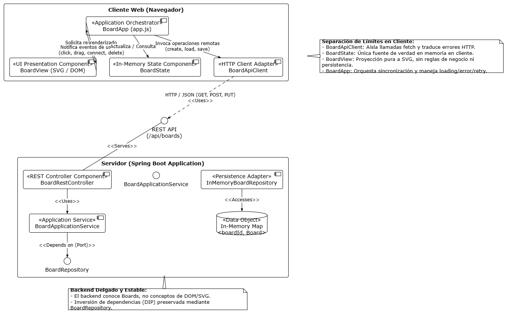
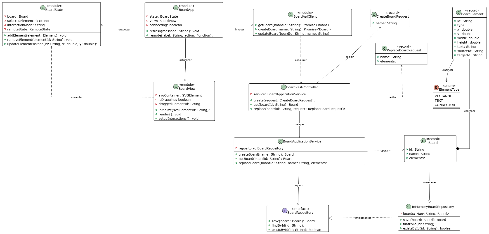

# Evidencia Arquitectónica — Lab 05: Interactive Board

Este documento consolida la evidencia arquitectónica del **Laboratorio 5**, reflejando la evolución del sistema desde el Lab 4 mediante la integración de un **cliente web desacoplado basado en SVG** y la evolución del modelo de dominio con conectores (`CONNECTOR`).

---

## 8.1 Vista de Aplicación — ArchiMate

Evolución de la vista de aplicación del Lab 4 para incorporar las capacidades del cliente web desacoplado y sus límites con respecto a la interfaz REST y el núcleo de la aplicación.

### Diagrama de Vista de Aplicación

### Justificación de Componentes y Límites
- **Cliente Web (Navegador)**: Descompuesto en cuatro módulos desacoplados para garantizar separación de responsabilidades:
   - `BoardView` (Presentación UI): Proyección reactiva al SVG y captura de eventos del usuario. No conoce endpoints REST ni excepciones Java.
   - `BoardState` (Gestor de Estado): Única fuente de verdad en memoria en el cliente. Contiene el tablero, elemento seleccionado, modo de interacción y estado remoto.
   - `BoardApp` (`app.js` - Orquestador): Coordina las acciones del usuario, actualiza el estado y gestiona el ciclo de vida de peticiones (`loading`, `error`, `retry`).
   - `BoardApiClient` (Adaptador HTTP): Centraliza y aísla todas las llamadas `fetch` y estandariza el manejo de errores HTTP.
- **REST Interface (`/api/boards`)**: Punto de desacoplamiento formal entre cliente y servidor mediante HTTP/JSON estandarizado (POST, GET, PUT).
- **Application Core (`BoardApplicationService`)**: Expone la lógica de aplicación sin contaminarse de conceptos web ni de DOM/SVG.
- **Persistencia e Inversión de Dependencias (DIP)**: `BoardApplicationService` depende exclusivamente de la interfaz de puerto `BoardRepository`, implementada por `InMemoryBoardRepository` que accede al almacenamiento en memoria (`ConcurrentMap`).

---

## 8.2 Diagrama de Clases y Módulos

El diagrama explica las dependencias e interacciones reales entre los módulos principales del cliente y las clases relevantes del backend, utilizando **verbos únicos en infinitivo** para cada conexión conforme a los estándares de modelado UML y evitando convertirse en un inventario innecesario de código.

### Diagrama de Clases y Módulos

### Relaciones y Verbos de Dependencia
- **Módulos Frontend**:
   - `BoardApp` $\rightarrow$ `BoardApiClient`: **invocar** (orquesta las operaciones remotas).
   - `BoardApp` $\rightarrow$ `BoardState`: **orquestar** (coordina las transiciones y estado de red).
   - `BoardApp` $\rightarrow$ `BoardView`: **actualizar** (solicita el re-renderizado del lienzo).
   - `BoardView` $\rightarrow$ `BoardState`: **consultar** (obtiene la estructura del tablero para proyectarla en SVG).
- **Frontera de Red (Cliente - Servidor)**:
   - `BoardApiClient` $\dashrightarrow$ `BoardRestController`: **consumir** (envía peticiones HTTP/JSON vía `fetch`).
- **Capa Backend**:
   - `BoardRestController` $\rightarrow$ `BoardApplicationService`: **delegar** (delega el caso de uso tras recibir la petición HTTP).
   - `BoardRestController` $\dashrightarrow$ `CreateBoardRequest` / `ReplaceBoardRequest`: **recibir** (obtiene los DTOs validados en el cuerpo de la petición).
   - `BoardApplicationService` $\rightarrow$ `BoardRepository`: **requerir** (depende del contrato abstracto del puerto de persistencia).
   - `InMemoryBoardRepository` $\dashrightarrow$ `BoardRepository`: **implementar** (realiza el puerto como adaptador en memoria).
   - `InMemoryBoardRepository` $\diamond--$ `Board`: **almacenar** (persiste las instancias de tableros).
   - `BoardApplicationService` $\dashrightarrow$ `Board`: **operar** (manipula y retorna la entidad).
   - `Board` $*--$ `BoardElement`: **contener** (composición de elementos del tablero).
   - `BoardElement` $\rightarrow$ `ElementType`: **clasificar** (asigna el tipo `RECTANGLE`, `TEXT` o `CONNECTOR`).

---

## 8.3 ADR-002 — Client Boundaries

El registro formal de decisión arquitectónica que justifica la separación entre API Client, Estado y Vista, así como la preparación para WebSockets (Lab 6), se encuentra documentado en:
- [ADR-002: Client Boundaries](../ADR-002-client-boundaries.md)

---

## 8.4 Declaración de Uso de IA

El registro de trazabilidad, propósitos, validaciones y modificaciones de herramientas de Inteligencia Artificial para esta entrega se encuentra documentado en:
- [AI Usage Declaration](../AI_USAGE.md)

---

## Regla de Calidad

Los diagramas y documentación describen con precisión el código real entregado en el repositorio, manteniendo el backend delgado y desacoplado, sin clases decorativas de framework y con límites modulares claros listos para la evolución en tiempo real.